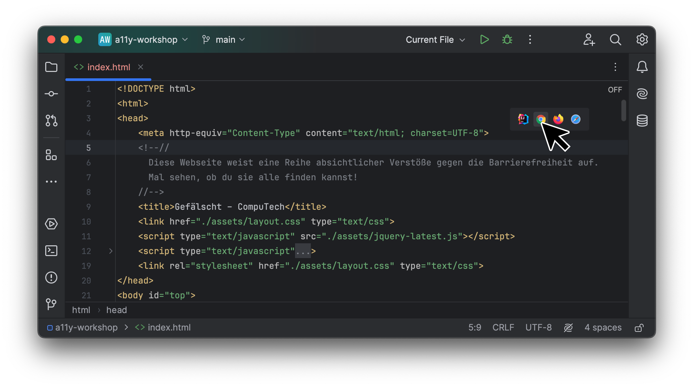

<div>
  <h1 align="center">A11y-Testing</h1>
  <hr>
  
</div>

<hr />

## Setup

Klone dieses Repository, um mit der Übungsaufgabe beginnen zu können und öffne es in einer Entwicklungsumgebung deiner Wahl.

> Empfohlen wird die Verwendung von [IntelliJ IDEA](https://www.jetbrains.com/de-de/idea/).

```
git clone https://github.com/jona-d01/a11y-workshop.git
```


## Übungsaufgabe

> Teste die im Repository hinterlegte HTML-Datei auf Verstöße gegen die Barrierefreiheit.

Anleitung:
1. Installiere den Browser: [Google Chrome](https://www.google.com/intl/de/chrome/)

2. Öffne die HTML-Datei: [index.html](index.html) lokal in Google Chrome
   

3. Finde mind. 10 verschiedene Verstöße gegen die Barrierefreiheit.<br>
   Nutze dafür beispielsweise das [Lighthouse](https://chromewebstore.google.com/detail/lighthouse/blipmdconlkpinefehnmjammfjpmpbjk?hl=de) Plug-in für Google Chrome. 

4. Notiere die von dir gefundenen Verstöße.<br>
   Die folgende Tabelle dient dabei als Hilfestellung.

   | Nr. | Beschreibung                                 | WCAG-Kriterium | mögliche Fehlerbehebung                                                      | Zeile im Quellcode |
   |-----|----------------------------------------------|----------------|------------------------------------------------------------------------------|--------------------|
   | 1   | Image ohne alt                               | 2.2 A          | Alt Text hinzufügen                                                          | 90                 |
   | 2   | Form Element without label                   | 2.2 A          | Label zum Input hinzufügen                                                   | 34                 |
   | 3   | Background / Foreground Color Contrast       | 2.2 AA         | Farbe fixen                                                                  | 38 - 57            |
   | 4   | Links nicht erkennbar ohne Farbe             | 2.2 A          | Link unterstreichen oder so                                                  | 91                 |
   | 5   | html Element hat kein lang Attribut          | 2.2 A          | Lang Attribut festlegen                                                      | 2                  |
   | 6   | H3 direkt hinter einer H1 ohne H2 dazwischen | Best practice  | H2 einfügen oder H3 zu H2 machen                                             | 64                 |
   | 7   | Dokument hat kein main                       | Best practice  | Den haupt content in nem main wrappen bzw wrapper zu nem main Element machen | 22                 |
   | 8   | Header ist kein semantischer header          | Best practice  | Header div zu nem header machen                                              | 23                 |
   | 9   | Footer ist kein semantischer footer          | Best practice  | Footer div zu nem footer machen                                              | 141                |
   | 10  | Navbar ist kein nav                          | Best practice  | Nav bar div zu nem nav machen                                                | 38                 |
   | ... |                                              |                |                                                                              |                    |
    
### Hilfreiche Links:

- [Web Content Accessibility Guidelines (WCAG) 2.2](https://www.w3.org/TR/WCAG22/)
- [WCAG 2.1 (deutsch)](https://outline-rocks.github.io/wcag/translations/WCAG21-de/)
- [axe DevTools](https://chromewebstore.google.com/detail/axe-devtools-web-accessib/lhdoppojpmngadmnindnejefpokejbdd)
- [Deque Color Contrast Analyzer](https://dequeuniversity.com/color-contrast)
